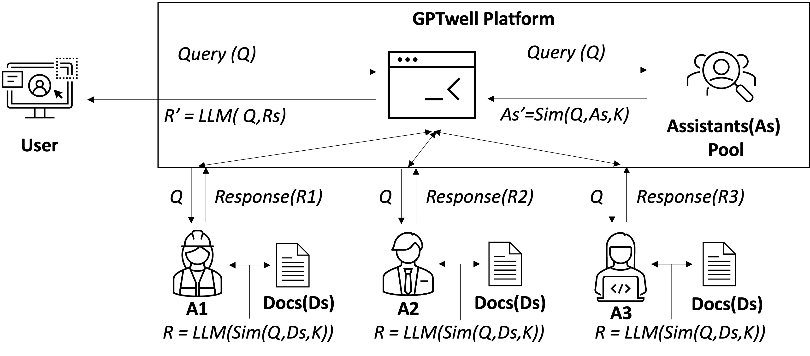

# GPTWell

GPTWell is a Federated AI Assistant platform for integrating multiple independent AI Assistants. ([Paper](https://doi.org/10.3997/2214-4609.202410298))

https://github.com/thejungwon/GPTWell/assets/12247655/c8e2783f-7cf7-4c4e-8831-ea3224a561a4


## System Architecture



## Prerequisite

- OpenAI API Key
- Assistant Id

## How to build an AI assistant

- [OpenAI Assistant](https://platform.openai.com/docs/assistants/overview)
- Hosting your own local model

## How to run

```
pip install -r requirements.txt
strealit run main.py
```

---

- In this project, we predefined the assistant in the `initial_assistant.json` file. You need to use your own assistant id.
- We used three virtual reports(`data/report1.txt`, `data/report2.txt`, `data/report3.txt`) generated by ChatGPT.

## Contributors

- [Jungwon Seo](https://github.com/thejungwon)
- [Boyu Cui](https://github.com/MaxwellCBY)
